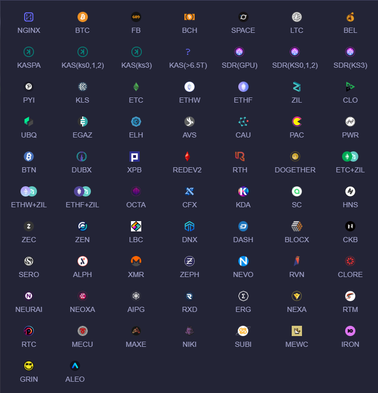
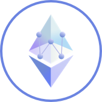
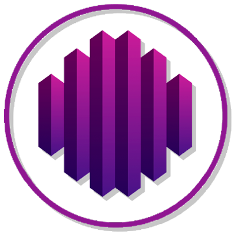
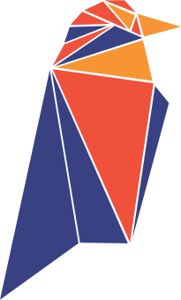

<div id="top"></div>

<div align="center">

# <a href="https://pool.p2pool.xyz"> cakesysteam和p2pool已被污染，请勿使用，如果发生算力下降，请尽快切换至hashcake：</a>

# <a href="https://github.com/hashultra/hashcake ">https://github.com/hashultra/hashcake </a>


[](https://git.io/typing-svg)

[](https://git.io/typing-svg)




<br>
<br>

<a href="#dingzhi">
   
</a>
<a href="#anzhuang">
   
</a>
<a href="#liaotian" target="_blank">
   
</a>
<a href="#gengxin" target="_blank">
   
</a>
<a href="https://github.com/CakeSystem/RMS" target="_blank">
   
</a>


[![CakeSystem][CakeSystem.io-badge]][CakeSystem.io]
[![Stargazers][stars-shield]][stars-url]

<!-- <a href="https://github.com/CakeSystem/p2pool">简体中文</a>｜<a href="https://github.com/CakeSystem/p2pool/tree/main/Readme/i18n">English</a> -->

</div>

# P2POOL

<table>
   <tr>
   <td>

<span id="anzhuang"></span>

### 👉 **Linux安装**

   <p>&emsp;&emsp;运行以下shell指令以运行工具包</p>

   ```sh
bash <(curl -s -L https://raw.githubusercontent.com/CakeSystem/p2pool/main/install.sh)
   ```
   
   <p>&emsp;&emsp;成功运行后，您将看到以下菜单, 根据提示安装即可。</p>
   
   &nbsp;&nbsp;&nbsp;&nbsp;&nbsp;&nbsp;&nbsp;

   <p>&emsp;&emsp;默认后台账号密码为 qzpm19kkx xloqslz913</p>

   </td>
   </tr>
   <tr>
   <td>

### 👉 **Windows安装**

   <p>&emsp;&emsp;请直接从此项目的Windows目录下载指定的版本：</p>

   ```sh
https://github.com/CakeSystem/p2pool/tree/main/windows
   ```

   <p>&emsp;&emsp;Windows版本直接双击启动即可。</p>

   <p>&emsp;&emsp;默认后台账号密码为 qzpm19kkx xloqslz913</p>

   </td>
   </tr>   
   <tr>
   <td>
  
### 👉 **支持的算法及币种**

<p>&emsp;&emsp;对于支持的算法，相应的货币将随时热更新</p>

<div>
&nbsp;&nbsp;&nbsp;&nbsp;&nbsp;&nbsp;&nbsp;










</div>

```text
  算法                支持的币种
  SHA256              BTC、BCH        
  ETHASH              ETC、ETHW、ETHF、OCTA、 ETC+ZIL、ETHW+ZIL、ETHF+ZIL、CLORE、NEURAI、NEOXA、ZIL、CLO、UBQ、EGAZ、ELH、AVS、CAU、PAC、PWR、BTN、DUBX、XPB、REDEV2、RTH
  SCRYPT              LTC
  KHEAVYHASH          KASPA
  KARLSENHASH         KLS
  BLAKE2S             KDA
  BLAKE2B             SC、HNS
  OCTOPUS             CFX
  DYNEXSOLVE          DNX
  EAGLESONG           CKB
  EQUIHASH            ZEN、ZEC
  LBRY                LBC
  X11                 DASH、BLOCX
  PROGPOW             SERO
  BLAKE3              ALPH
  RANDOMX             XMR、ZEPH、NEVO
  KAWPOW              RVN、MEWC
  SHA512256D          RXD
  AUTOYKOS2           ERG                
  NEXAPOW             NEXA
  GHOSTRIDER          RTM、RTC、MECU、MAXE、NIKI、SUBI、NEVO
```


   </td>
   </tr>
   <tr>
   <td>

<span id="liaotian"></span>


### 👉 **加入聊天组**

<p>&emsp;&emsp;Telegram：<a href="https://t.me/www_p2pool_xyz">https://t.me/www_p2pool_xyz</a></p>

<!-- <p>&emsp;&emsp;Discord: <a href="https://discord.gg/xpjRnv8wpX">https://discord.gg/xpjRnv8wpX</a></p> -->

   </td>
   </tr>
   <tr>
   <td>

### 👉 **特别感谢**

&nbsp;&nbsp;&nbsp;&nbsp;&nbsp;&nbsp;&nbsp;


&nbsp;&nbsp;&nbsp;&nbsp;&nbsp;&nbsp;&nbsp;


<p>&nbsp;&nbsp;&nbsp;&nbsp;&nbsp;&nbsp;&nbsp;感谢以上矿池在一定范围内提供了技术支持😊</p>

   </td>
   </tr>
   <tr>
   <td>

### 👉 **服务协议**

   <p>&nbsp;&nbsp;&nbsp;&nbsp;&nbsp;&nbsp;&nbsp;P2POOL受香港法律监管。请注意，不同国家/地区的法律要求可能会限制此类产品和服务。因此，该产品和服务以及某些功能可能不可用，或者在某些司法管辖区或地区或某些用户中可能受到限制。您应该理解并遵守当地的法律法规。如果您使用此产品，默认代表将接受上述许可证。如果本产品引起的法律问题与本产品无关。</p>

   </td>
   </tr>
   <tr>
   <td>

<span id="gengxin"></span>


### 👉 **Other issues**

   <p>&emsp;&emsp;这是一个免费软件，不收取任何费用。从技术角度来看，它只需要终端设备计算能力的0.2%作为技术回报。</p>

   </tr>
   </td>

</table>


[CakeSystem.io]: https://github.com/CakeSystem/p2pool
[CakeSystem.io-badge]: https://img.shields.io/badge/p2pool-v4.1.2-green?logo=Cake
[downloads-badge]: https://img.shields.io/github/downloads/ajeetdsouza/zoxide/total?logo=github&logoColor=white&style=flat-square
[releases]: https://github.com/CakeSystem/p2pool/releases
[stars-url]: https://github.com/CakeSystem/p2pool/stargazers
[stars-shield]: https://img.shields.io/github/stars/CakeSystem/p2pool.svg?style=flat
[stars-url]: https://github.com/CakeSystem/p2pool/stargazers
